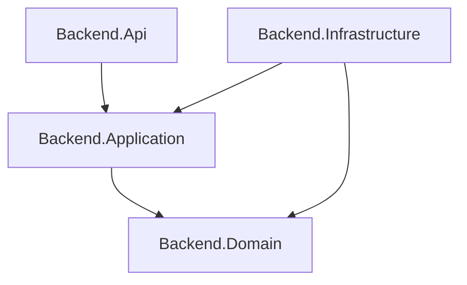

# Architecture Rules

## Backend Architecture

### 4-Layer Clean Architecture

```
Backend.Api            → Presentation Layer (Controllers, Middleware)
Backend.Application    → Application Layer (CQRS, Validators, Interfaces)
Backend.Domain         → Domain Layer (Entities, Enums)
Backend.Infrastructure → Infrastructure Layer (EF Core, External Services)
```

### Dependency Rules (BẮT BUỘC)



| Rule | Description |
|------|-------------|
| ✅ Api → Application | Controllers call Commands/Queries via MediatR |
| ✅ Application → Domain | Use cases access entities |
| ✅ Infrastructure → Application | Implements interfaces from Application |
| ❌ Domain → Any | Domain KHÔNG reference bất kỳ layer nào |
| ❌ Application → Infrastructure | Application KHÔNG trực tiếp access Infrastructure |
| ❌ Api → DbContext | Api KHÔNG truy cập DbContext/Repository |

---

### Backend Folder Structure

```
Backend.Api/
├── Controllers/           # Thin controllers, only MediatR calls
├── Middlewares/          # Custom middleware
├── Extensions/           # DI registration helpers
└── Program.cs            # Entry point

Backend.Application/
├── Features/             # Feature-based organization
│   ├── Auth/
│   │   ├── Commands/     # RegisterCommand, LoginCommand
│   │   ├── Queries/      # GetUserQuery
│   │   └── Contracts/    # IAuthRepository
│   ├── Sneaker/
│   ├── Brand/
│   └── Order/
├── Common/
│   ├── Behaviors/        # Pipeline behaviors
│   ├── Interfaces/       # Shared interfaces (IUnitOfWork)
│   └── Mappings/         # Extension methods for mapping
└── DependencyInjection.cs

Backend.Domain/
├── Entities/             # Pure domain entities
│   ├── Account.cs
│   ├── Sneaker.cs
│   └── Order.cs
├── Enums/               # Domain enums
└── Common/              # Base entity, value objects

Backend.Infrastructure/
├── Data/
│   ├── AppDbContext.cs
│   ├── Configurations/   # EF Core entity configs
│   └── Migrations/
├── Repositories/         # Repository implementations
├── Services/            # External service implementations
└── ServiceRegistration.cs
```

---

### CQRS Pattern (BẮT BUỘC)

#### Command Structure
Mỗi command feature bắt buộc có 4 files:

```
Features/{Feature}/Commands/{Action}/
├── {Action}Command.cs           # Input record
├── {Action}CommandHandler.cs    # Business logic
├── {Action}CommandValidator.cs  # FluentValidation
└── {Action}Result.cs            # Output record
```

#### Query Structure
```
Features/{Feature}/Queries/{Action}/
├── {Action}Query.cs
├── {Action}QueryHandler.cs
└── {Action}Result.cs    # hoặc List<{Item}Dto>
```

---

### No Namespace Rule (BẮT BUỘC)

```csharp
// ❌ WRONG - Không dùng namespace
namespace Backend.Application.Features.Auth;

public sealed record RegisterCommand(...);

// ✅ CORRECT - File-scoped, no namespace
public sealed record RegisterCommand(
    string Email,
    string Phone,
    string Password
) : IRequest<RegisterResult>;
```

---

## Frontend Architecture

### Feature-Based Structure

```
app/
├── routes/              # Thin route components (SEO + mount feature only)
│   ├── public/
│   │   ├── home.tsx
│   │   └── products.tsx
│   ├── admin/
│   └── auth/
├── components/
│   ├── feature/         # Feature logic & UI
│   │   ├── auth/
│   │   ├── product/
│   │   └── cart/
│   ├── common/          # Reusable presentational components
│   │   ├── button/
│   │   ├── card/
│   │   └── modal/
│   ├── ui/              # ShadcnUI primitives
│   └── provider/        # Context providers
├── services/            # API calls + DTOs
│   ├── auth/
│   │   ├── auth.service.ts
│   │   ├── auth.server.ts
│   │   └── dto/
│   └── product/
├── store/               # Redux slices
│   ├── auth/
│   └── store.ts
├── hooks/               # Custom hooks
│   ├── redux.tsx
│   └── react-query/
├── types/               # TypeScript types
│   ├── entities/
│   └── global/
├── common/              # Configs, constants, helpers
│   ├── configs/
│   ├── constants/
│   └── helpers/
└── layouts/             # Layout components
```

---

### Route Layer Rules

```tsx
// ✅ CORRECT - Thin route
export default function ProductsPage() {
  return (
    <MainLayout>
      <ProductList />  {/* Feature component */}
    </MainLayout>
  );
}

export function meta() {
  return [{ title: "Products | Sneaker Shop" }];
}

// ❌ WRONG - Logic in route
export default function ProductsPage() {
  const [products, setProducts] = useState([]);
  
  useEffect(() => {
    fetch("/api/products").then(...);  // ❌ API call in route
  }, []);
  
  return <div>{/* render logic */}</div>;
}
```

---

### Component Layer Separation

| Layer | Allowed | Not Allowed |
|-------|---------|-------------|
| `routes/` | Mount features, SEO meta | API calls, business logic |
| `components/feature/` | API calls, forms, local state, Redux | N/A |
| `components/common/` | Props-based render | Service calls, Redux access |
| `services/` | HTTP calls, DTO definitions | UI rendering |
| `store/` | Shared state only | Local component state |

---

### State Management Decision Matrix

| Scenario | Use |
|----------|-----|
| Server data (lists, details) | React Query |
| Auth/User session | Redux + persist |
| Form state | react-hook-form |
| UI state (modal open/close) | React useState |
| Cross-component shared data | Redux |